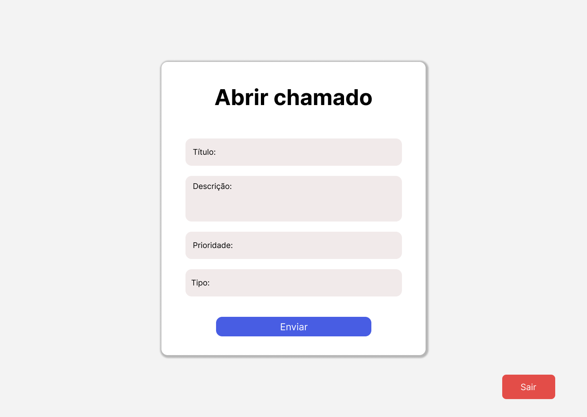

# 🛠️ SGCT - Sistema de Gestão de Chamados Técnicos

O **SGCT** é um sistema web simples e funcional, desenvolvido com HTML, CSS e JavaScript puro, que permite o gerenciamento de chamados técnicos de forma organizada, rápida e intuitiva.

## 🎯 Objetivo

Facilitar a visualização, edição e acompanhamento de chamados técnicos por parte da equipe de suporte, através de uma interface leve com recursos práticos como:

- Visualização dos chamados em tabela
- Expansão de detalhes com botão "Ver mais"
- Edição rápida de campos como **Status** e **Prioridade**

---

## 💻 Tecnologias Utilizadas

- HTML5
- CSS3
- JavaScript 
- Node.js
- MySQL

---

## 📋 Funcionalidades

- [x] Listagem de chamados em tabela
- [x] Botão "Ver mais" para exibir detalhes do chamado
- [x] Visualização de informações: ID, Título, Descrição, Status, Prioridade, Data de Criação
- [x] Edição inline de **Status** e **Prioridade** com ícone de lápis ✏️
- [ ] Integração com backend para salvar alterações (em desenvolvimento)
- [ ] Login e controle de acesso (planejado)

---
## 🖼️ Preview do Design

