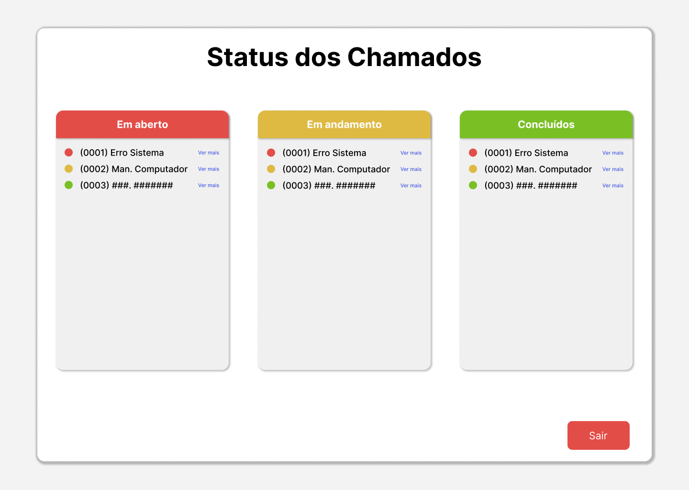

# 🛠️ SGCT - Sistema de Gestão de Chamados Técnicos

O **SGCT** é um sistema web simples e funcional, desenvolvido com HTML, CSS e JavaScript puro, que permite o gerenciamento de chamados técnicos de forma organizada, rápida e intuitiva.

## 🎯 Objetivo

Facilitar a visualização, edição e acompanhamento de chamados técnicos por parte da equipe de suporte, através de uma interface leve com recursos práticos como:

- Visualização dos chamados em tabela
- Expansão de detalhes com botão "Ver mais"
- Edição rápida de campos como **Status** e **Prioridade**

---

## 💻 Tecnologias Utilizadas

- **HTML5 & CSS3** – Estrutura e estilo das páginas
- **JavaScript** – Lógica do front-end e back-end
- **Node.js** – Ambiente de execução do back-end
- **Express** – Framework para servidor e rotas
- **MySQL** – Banco de dados relacional

---

## 📋 Funcionalidades

- [x] Listagem de chamados em tabela
- [x] Visualização detalhada dos chamados ("Ver mais")
- [x] Edição inline de **Status** e **Prioridade**
- [x] Cadastro e login de usuários
- [x] Controle de acesso por tipo de usuário
- [ ] Integração completa do front-end com o back-end (em desenvolvimento)
- [ ] Persistência total dos chamados no banco de dados (em desenvolviment

---

## 🚀 Como rodar o projeto

1. **Clone o repositório:**  
   ```bash
   git clone https://github.com/igor-vasconcellos/SGCT-.git

---
## 🖼️ Preview do Design





